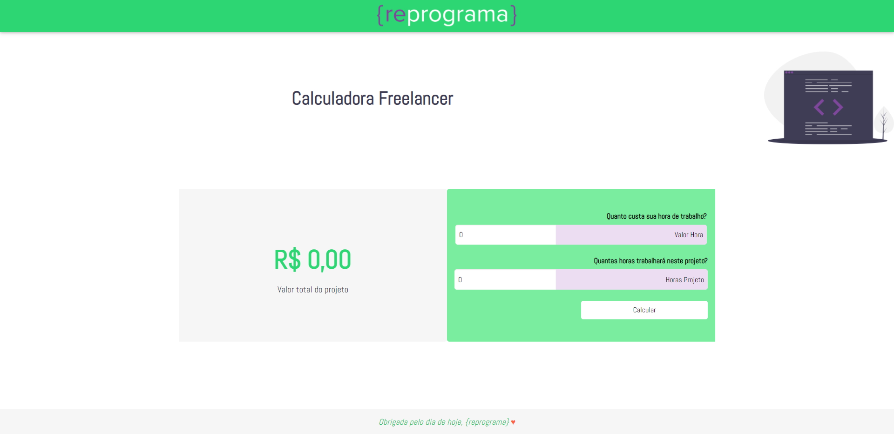

#  Calculadora Freelancer - JavaScript 

- A Calculadora Freelancer é resultado do desafio realizado durante a oficina de seleção do {reprograma}, a primeira parte calcula o valor da hora de trabalho baseado no salário e na jornada diária, a segunda (o desafio) calcula o valor do projeto baseado no valor da hora de trabalho e nas jornada em horas do projeto;
- É um projeto com design lindo e bastante útil para quem trabalha como Freelancer e quer agilizar um pouco o cálculo do valor que deve cobrar pelo seu trabalho;

